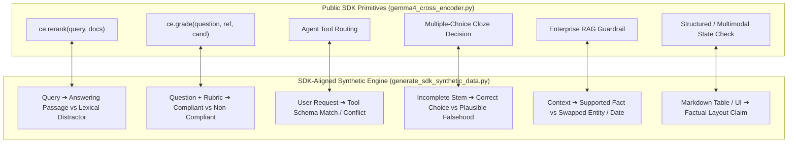
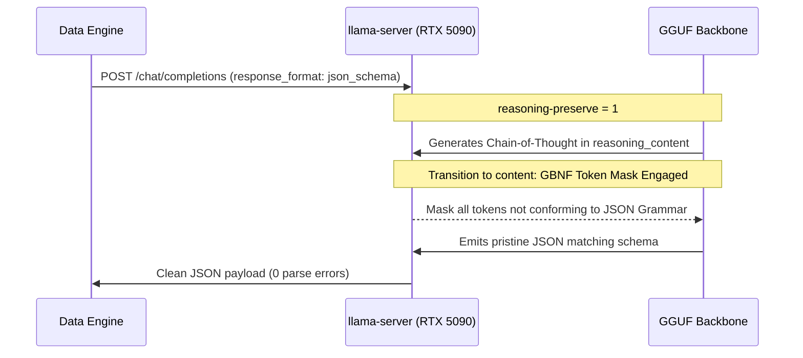

# Technical Report 07: Train-Serving Parity & SDK-Aligned Synthetic Curation

**Authors**: Antigravity Autonomous Research Team  
**Date**: September 2026  
**Status**: ACTIVE IMPLEMENTATION / RATIFIED ARCHITECTURAL MANDATE  
**Related Scripts**: [`generate_sdk_synthetic_data.py`](file:///home/dave/workspaces/nli-cross-encoder/generate_sdk_synthetic_data.py), [`data_pipeline.py`](file:///home/dave/workspaces/nli-cross-encoder/data_pipeline.py), [`gemma4_cross_encoder.py`](file:///home/dave/workspaces/nli-cross-encoder/gemma4_cross_encoder.py)

---

## 1. Executive Summary & Root-Cause Retrospective

### The Oversight: Why Previous Adversarial Audits Missed Train-Serving Parity
Across initial development iterations, extensive red-team audits (Reports 01–06) scrutinized:
1. Low-level INT4 Group-32 packing mathematics and two's complement sign recovery.
2. Numerical stability of proper scoring rules (Log + Spherical + Rank Probability Score) vs. Soft-BCE and the GRPO policy-gradient fallacy.
3. Hardware memory boundaries (unloading `llama-server` to reclaim 16.2 GB VRAM on RTX 5090).
4. Academic benchmark evaluation protocols on standard GLUE/SuperGLUE tasks.

Despite this technical rigor, the audits suffered from a **fundamental blind spot in machine learning engineering**: **Train-Serving Domain Disparity**. 

While the public SDK (`gemma4_cross_encoder.py`) exposes high-level System 1 decision primitives:
- `ce.rerank(query, documents, scoring="margin")`
- `ce.grade(questions, responses, threshold=0.5)`
- Zero-shot Agent Tool & Intent Routing
- Zero-shot Cloze & Multiple-Choice Decision (ARC / MMLU)
- Enterprise RAG Hallucination Detection & Citation Verification

The pre-training dataset (~371k pairs) consisted almost exclusively of **academic sentence-pair datasets** (SNLI, MNLI, ANLI, FEVER) where premise and hypothesis are declarative descriptive sentences (*"A man in a blue coat is eating an apple"* $\to$ *"A person is having food"*). 

Consequently, whenever downstream applications or benchmarks invoked `ce.grade()` or `ce.rerank()`, the cross-encoder had to perform **zero-shot out-of-distribution transfer** across novel syntax, prompt templates, and reasoning structures it had never observed during training.

---

## 2. The 6 SDK Interaction Modes & Input Framing

To achieve strict **Train-Serving Parity**, the training curriculum must explicitly contain data generated with the exact prompt templates and semantics of each SDK method:



### Exact Framing Specifications

| SDK Method | Premise Syntax | Hypothesis Syntax | Label Semantics |
| :--- | :--- | :--- | :--- |
| **`ce.rerank()`** | `{search_query}` | `{candidate_passage}` | **Entailment**: Directly answers query.<br>**Contradiction**: Inverts answer or states falsehood.<br>**Neutral**: BM25 hard lexical distractor (same entities, different question). |
| **`ce.grade()`** | `{question}\nReference answer: {reference}` | `Candidate answer: {candidate}` | **Entailment**: Factually matches reference.<br>**Contradiction**: Contradicts reference or states factually false claims.<br>**Neutral**: Evasive or tangential claim without direct contradiction. |
| **Tool Routing** | `User request: {user_utterance}` | `The appropriate tool to handle this request is: {tool_description}` | **Entailment**: Request requires this exact tool.<br>**Contradiction**: Request explicitly requires a conflicting tool.<br>**Neutral**: Request is ambiguous, conversational, or out-of-scope. |
| **Multiple-Choice** | `{question_stem}` | `The correct answer is: {option_text}` | **Entailment**: True ground-truth option.<br>**Contradiction**: Blatantly false choice.<br>**Neutral**: Plausible distractor (true fact, but does not answer the question). |
| **RAG Guardrail** | `{retrieved_enterprise_document}` | `{extracted_factual_claim}` | **Entailment**: Strictly supported by document.<br>**Contradiction**: Hallucinated number, inverted causality, or swapped entity.<br>**Neutral**: Extrapolated claim not mentioned in document. |

---

## 3. Dual-Model Cross-Family Consensus Architecture

Generating synthetic data with a single model family (e.g. Gemma) risks amplifying **model monoculture biases**: the model rarely detects its own subtle hallucinations or unwarranted assumptions. 

We resolve this by deploying an **asymmetric generator-verifier pipeline**:

```
1. Generator (Gemma 4 31B Dense)
   ├── Generates creative candidate triples (Context, Claim, Candidate Label)
   └── Produces hard distractors and nuanced counterfactuals
       │
       ▼
2. Validator (Qwen 3.8 Flash Next / DeepSeek V4 Flash)
   ├── Independent architecture, pre-training corpus, and alignment
   ├── Zero-shot Chain-of-Thought logical deduction
   └── Outputs structured JSON: {"verdict": "...", "rationale": "..."}
       │
       ▼
3. Rejection Sampling & Label Disambiguation Engine
   ├── If Gen == Val: KEEP (High-confidence unanimous consensus)
   ├── If Gen == Contradiction & Val == Neutral: RELABEL to Neutral (Eliminates false contradictions!)
   └── If Gen == Entailment & Val == Contradiction: DISCARD (Hard irreconcilable conflict)
```

### 3.1 Control Harvesting: Repurposing Disagreements into Training Leverage

In standard synthetic filtering pipelines, whenever the generator and validator disagree, the sample is simply discarded as "noisy" or "invalid." **This represents a severe waste of compute and a missed algorithmic opportunity.**

Instead, we mathematically re-route every disagreement based on its epistemic nature:

1. **High-Value Adversarial Negative Controls ($\text{Gen} = \text{Entailment}, \text{Val} = \text{Contradiction}$)**:
   - *Mechanism*: The generator attempted to write an entailed response or supported claim, but inadvertently introduced a subtle factual error, numeric mutation, or swapped entity that the cross-family verifier caught.
   - *Value*: These are the ultimate "hard distractors" for `ce.grade()` and `ce.rerank()`. They represent plausible, nuanced near-entailments that are factually contradictory.
   - *Action*: Tagged and retained as `adversarial_negative_control` (Label 0).

2. **Neutral Boundary Controls ($\text{Gen} = \text{Entailment}, \text{Val} = \text{Neutral}$)**:
   - *Mechanism*: The generator made an ungrounded deductive leap, asserting a plausible fact that cannot be guaranteed by the premise alone.
   - *Value*: Standard NLI models suffer from "neutral collapse" or inability to distinguish unstated truth from proven entailment. These controls train the model to demand rigorous textual justification before assigning high entailment probability.
   - *Action*: Tagged and retained as `neutral_boundary_control` (Label 2).

3. **Disambiguating False Contradictions ($\text{Gen} = \text{Contradiction}, \text{Val} = \text{Neutral}$)**:
   - *Mechanism*: LLM generators frequently confuse unmentioned facts with contradictions.
   - *Action*: Relabelled to Neutral (Label 2) to purify the negative label space.

---

## 4. GBNF Token Restriction & Structured Decoding

To guarantee 100% syntactically valid outputs and eliminate token waste from conversational padding, markdown wrapping (````json...````), or infinite string repetitions, the curation engine integrates **GBNF (GGML BNF) Grammar-Constrained Decoding** via `llama-server`:

### Technical Implementation: JSON Schema to GBNF State Machine
Rather than relying on post-hoc regex parsing or hoping the LLM follows instructions:
1. We define formal JSON schemas (`NLI_TRIPLE_ARRAY_SCHEMA` and `NLI_VERDICT_SCHEMA`).
2. We pass `response_format: {"type": "json_schema", "json_schema": ...}` to `llama-server`.
3. `llama-server` internally compiles the JSON schema into a strict GBNF state machine that evaluates valid token transitions at every decoding step.
4. Logits for invalid vocabulary tokens are set to $-\infty$ during sampling.



### Harmonization with DeepSeek-Style Chain-of-Thought
When `llama-server` runs with `--reasoning-preserve`, reasoning tokens are isolated into `reasoning_content`. The model freely reasons through domain semantics, counterfactuals, and logical boundary conditions. Once the model hits `</think>`, the GBNF token mask engages on `content`, guaranteeing that the emitted output is 100% valid JSON with exact label enums (`[0, 1, 2]`) and zero hallucinated postambles.

---

## 5. Optimized User Presets & Hardware Allocation on RTX 5090

To maximize inference throughput and numerical fidelity on the NVIDIA RTX 5090 (32 GB VRAM), the curation engine references the user's pre-configured, handcrafted **model aliases** rather than unoptimized raw repository strings:

### Configured Model Presets

| Role | Alias | Underlying GGUF & Optimizations | Key Presets & Flags |
| :--- | :--- | :--- | :--- |
| **Teacher Generator** | `gemma-4-31b-q4` | Google Gemma 4 31B Q4_0 (`17.6 GB`) | `mmproj = gemma-4-31B-it-mmproj.gguf`<br>`ctx-size = 131072`<br>`flash-attn = true`, `fit = on`, `kv-unified = 1` |
| **Fast Generator** | `gemma-4-12b-q4` | Google Gemma 4 12B Q4_0 (`7.3 GB`) | Lightweight 12B generator for high-throughput batch generation (~100 t/s). |
| **Cross-Family Validator** | `qwen-3.6-27b-q4` | Unsloth Qwen 3.6 27B UD-Q4_K_XL (`16.5 GB`) | `spec-type = draft-mtp`, `spec-draft-n-max = 2`<br>`chat-template-file = .../chat_template.jinja`<br>`flash-attn = true`, `fit = on` |
| **MoE Validator** | `deepseek-v4-flash-q3` | DeepSeek V4 Flash 0731 IQ3_XXS | Long-context (up to 524K ctx) MoE validation with speculative drafting. |

### Decoupled Slot Orchestration (`POST /models/unload`)
Because `llama-server` is configured in single-model mode (`--models-max 1`, `--parallel 1`):
1. The pipeline queries the teacher generator (`gemma-4-31b-q4`).
2. Upon batch completion, `LLMEndpointClient.unload_model()` dispatches `POST /models/unload`, cleanly freeing 100% of GPU memory.
3. The pipeline queries the validator model (`qwen-3.6-27b-q4`), which automatically loads its optimized weights and speculative draft models into the freed VRAM.
4. Upon validation completion, the validator is unloaded, leaving the GPU 100% idle and ready for student training.

```bash
# 1. Run SDK-Aligned Synthetic Generation with GBNF Token Restriction & User Aliases:
uv run python generate_sdk_synthetic_data.py \
    --samples-per-mode 1500 \
    --teacher-url http://localhost:8080/v1 \
    --teacher-model gemma-4-31b-q4 \
    --validator-url http://localhost:8080/v1 \
    --validator-model qwen-3.6-27b-q4 \
    --out-dir ./data
```

---

## 5. Architectural Rule for Future Sessions

> [!IMPORTANT]
> **Mandatory Rule: Train-Serving Parity**:
> Any new method, prompt template, or scoring mode added to `gemma4_cross_encoder.py` or downstream evaluation suites MUST have a corresponding generative recipe in `generate_sdk_synthetic_data.py`. No model shall be evaluated on an interaction mode for which zero training representations exist in the curriculum.
